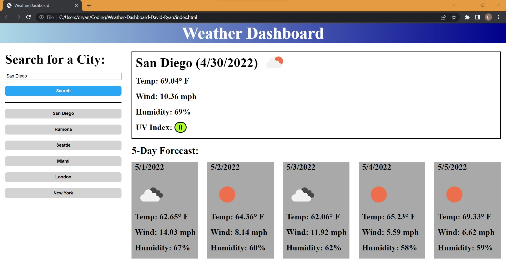

# Weather-Dashboard-David-Ryan

## <Weather-Dashboard-David-Ryan>
Bootcamp Homework 06 Weather Dashboard:\
A weather dashboard that will run in the browser and feature dynamically updated HTML and CSS as well as use of an API.

## Description

This is a simple weather dashboard.  The user can search for a town or city and is then shown the current weather and 5 day forecast for that town or city.

Upon loading the page, the user sees a nice header section in a gradient blue color that says "Weather Dashboard".  Below that and to the left the user sees an input field and a search button.  The input field loads in with "San Diego" being already filled in.  The user can replace this with their own choice of city by typing in this input field.  When the user clicks search, the right side of the screen is filled with data.  This data is generated from a series of API calls to certain OpenWeather APIs.  First a call is made to the OpenWeather Geocoding API in order to translate the name of the city into a latitude and longitude.  Then these coordinates are used for another call to the OpenWeather OneCall API to get the current weather of the city.  Another call is then made to the OpenWeather 5 Day Forecast API to get the 5 day forecast for the city.  Values are pulled from the data recieved from the APIs to populate temperature, wind speed, humidity, and UV index.  As the UV index is not commonly understood as the sole number that it is, it is highlighted in gren, orange, or red, depending on its value, to show the user the meaning of the number.  An icon representing the weather of each forecast (including the current weather) is shown next to the weather data.

Anytime a NEW city is searched, a button appears below the search button with the name of the city that was searched.  Clicking this button acts as if the user searched for this city again.  All the same API calls are made and the necessary data is once again shown to the user.  This list persists using local storage.  On loading the page, js checks if their is a list of past searches stored in local storage and, if they do exist, populates the list with these options.

## Screenshot

## Link to Deployed Website

https://kadika38.github.io/Weather-Dashboard-David-Ryan/